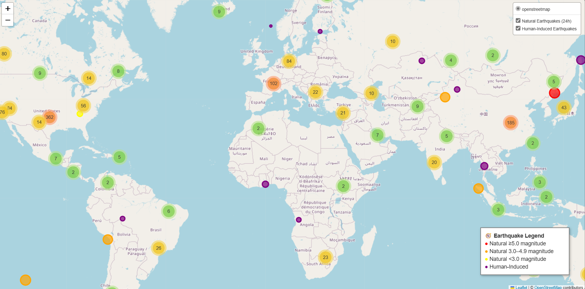

# Earthquake GIS Map
This project creates an interactive web map comparing natural and human-induced earthquakes. It combines data from the USGS Earthquake API and a human-induced earthquake dataset (HiQuake) to visualize earthquake locations, magnitudes, depths, and causes.

# Preview

# Data
- USGS Earthquakes (last 24h): https://earthquake.usgs.gov/earthquakes/feed/v1.0/summary/all_day.geojson
response = requests.get(usgs_url)
- Human-Induced Earthquakes (HiQuake dataset): https://inducedearthquakes.org/
    - Downloaded as CSV

# Features
Natural Earthquakes (24h)
- Data pulled directly from the USGS GeoJSON feed.
- Color-coded by magnitude:
    - 🔴 Magnitude ≥ 5.0
    - 🟠 Magnitude 3.0–4.9
    - 🟡 Magnitude < 3.0

Human-Induced Earthquakes
- Data loaded from the HiQuake CSV.
- Marker popups include:
    - Project name
    - Observed maximum magnitude
    - Number of recorded quakes (if available)
    - Earthquake cause (main class)
    - Tectonic setting

Interactive Features
- Clustered markers for easy navigation
- Legend indicating color codes
- Layer control to toggle between Natural and Human-Induced earthquakes
- Popups are dynamic — fields are hidden if data is missing or non-numeric

# Project Structure
hiq/
├─ hiq.py                           # Main Python script generating the interactive earthquake map
├─ HiQuake.csv                      # Human-Induced Earthquake dataset
├─ combined_earthquake_map.html     # Interactive map generated by hiq.py. Open in any browser to explore earthquakes

├─ README.md                        # Project description and instructions

# Requirements
- Python 3.9+
- Libraries:
    - requests
    - pandas
    - geopandas
    - shapely
    - folium

# Future Improvements
- Add dropdown filter for human-induced causes
- Analysis of magnitude by cause

# License
 - All rights reserved